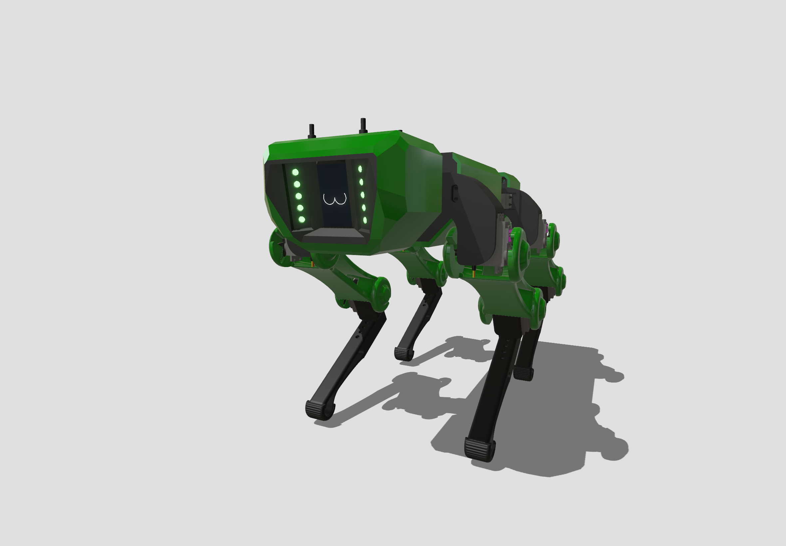

# Pit-Bit

# Low-Cost Modular Quadruped Robot for Educational and Multimodal Applications

## 📋 專案概述 | Project Overview

本專案致力於開發一款低成本、模組化的四足機器人，專為教育應用和多模態功能設計。透過模組化的設計理念，讓使用者能夠輕鬆學習機器人學基礎知識，同時支援多種感測器和應用場景。

This project focuses on developing a low-cost, modular quadruped robot designed for educational applications and multimodal functionality. Through modular design principles, users can easily learn robotics fundamentals while supporting various sensors and application scenarios.

## 🚧 開發狀態 | Development Status

**⚠️ 專案開發中，敬請期待！**

**⚠️ Project under development, stay tuned!**

## 🎯 專案目標 | Project Goals

- **低成本設計** | Low-Cost Design: 使用經濟實惠的元件，降低學習門檻
- **模組化架構** | Modular Architecture: 支援不同感測器和功能模組的擴展
- **教育導向** | Education-Focused: 提供完整的學習資源和範例程式
- **多模態應用** | Multimodal Applications: 支援視覺、聽覺、觸覺等多種感測模式

## 🔧 預計特色 | Planned Features

### 硬體規格 | Hardware Specifications
- 四足步行機構
- 模組化感測器接口
- 開源硬體設計
- 3D列印結構

### 軟體功能 | Software Features
- 步態控制算法
- 多感測器融合
- 遠端控制介面
- 程式教學範例

### 教育應用 | Educational Applications
- 機器人學基礎教學
- 控制系統實作
- 感測器整合實驗
- AI/ML應用實踐

---

**⭐ 如果您對此專案感興趣，歡迎給我們一個 Star！**

**⭐ If you're interested in this project, please give us a Star!**

*最後更新 | Last Updated: 2025年5月*
